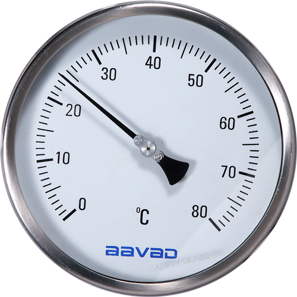
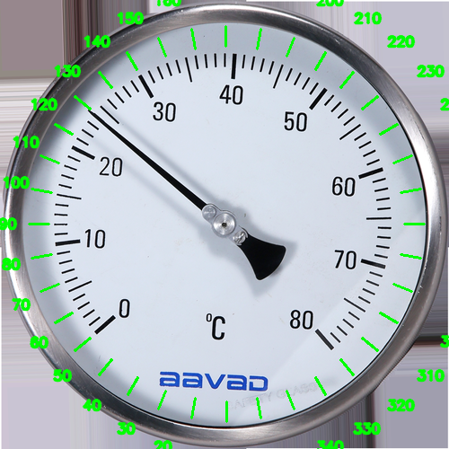

## clone方法

**サブモジュールを使用しているため、以下のコマンドでcloneすること**

```
git clone --recurse https://github.com/ryota0051/analog_meter_reader.git
```

## このアプリケーションについて

* どのようなアプリケーションか
  
  メータ画像から針の読みを取得するアプリケーション

* 対象メータ

  以下のような円形のメータ

  

* アルゴリズム

  1. メータの中心座標(x, y)と半径rをハフ変換により取得

  2. 輪郭抽出でメータの開始角度と終了角度を取得(手動入力も可)

  3. 針の座標をハフ変換により取得

  4. 取得した針の座標と円の中心との角度を算出

  5. 以下の式によりメータの読み値を取得

        (針の角度 - メータの最小角度) / (メータの角度幅) * メータの読み幅 + メータの読み最小値

        上記画像の例では、以下のように設定する。

        メータの最小角度: 50度
        
        メータの最大角度: 320度

        メータの角度幅: 320 - 50 = 270度

        メータの読み幅: 80 - 0 = 80℃

        メータの読み最小値: 0℃


## 使い方

1. Dockerイメージをビルドする

```
docker-compose build
```

2. `api/images` ディレクトリに対象画像を入れる(無ければ事前配置のものでも問題ない)。

3. 以下のコマンドを実行

* `--src` に対する値は手順2で配置した画像名に適宜変更

* 第1引数は、メータの読みの最小値

* 第2引数は、メータの読みの最大値

```
docker-compose run --rm api python main.py 0 200 --src meter1.jpg --unit Lb/in^2
```

上記の結果として、`18.741475486660157 Lb/in^2`が出力される。

また、--manual引数を与えると`api/image_for_manual`に--srcに入力した画像名と同じ画像が以下のように保存されるので、画像から角度の最小値と最大値を入力することもできる。

下記の画像では、

最小値: 50

最大値: 320

と入力する。



## 参考サイト

* https://github.com/intel-iot-devkit/python-cv-samples/tree/master/examples/analog-gauge-reader

* https://medium.com/@nayak.abhijeet1/analogue-gauge-reader-using-computer-vision-62fbd6ec84cc
